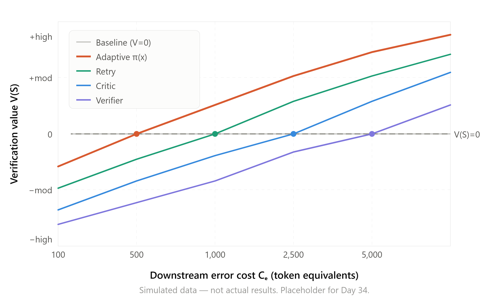
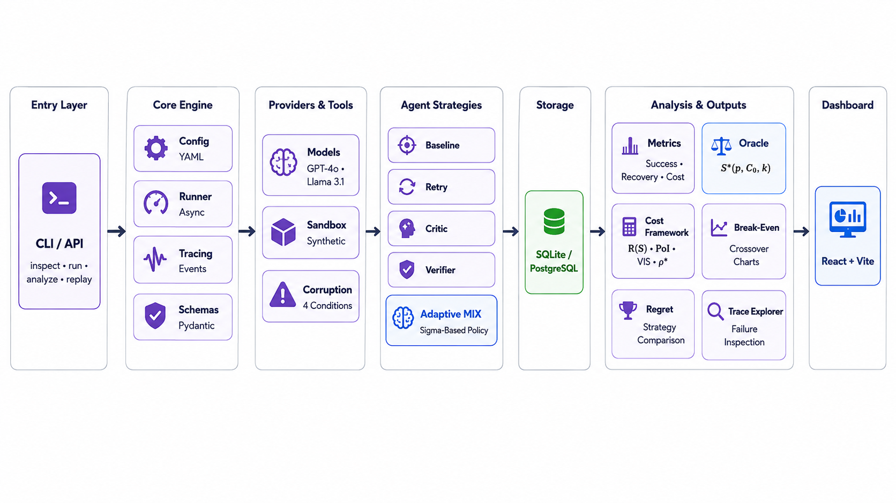

## TraceLLM-Faultline 

[](https://github.com/cybr-wisp/tracellm-faultline/actions)
[](https://www.python.org/downloads/)
[](LICENSE)
[](https://github.com/astral-sh/ruff)
**A cost-sensitive evaluation framework for measuring when tool-output verification helps, hurts, or wastes money in LLM agent systems.**


## Key finding

<!-- TODO: Replace with actual crossover chart after Day 34 -->
<p align="center">
  
</p>

<p align="center"><em>At what error cost does each strategy start paying for itself? The crossover chart maps the break-even frontier across all five strategies.</em></p>

---

## Research question

> What are the break-even conditions under which tool-output verification becomes cost-negative for LLM agents, how do these conditions vary across output conditions, and how closely can a signal-based adaptive policy track the oracle-optimal verification frontier?

## Why this matters

LLM agents increasingly call external tools in production. When those tools return bad data, the agent can either blindly trust it (cheap but dangerous) or verify it (safe but expensive). Most research assumes verification is beneficial and asks how to do it efficiently. We ask the prior question: **when does verification destroy value?**

We formalize this as a cost-minimization problem with an **oracle baseline** — if you knew exactly which outputs were corrupted and how, what would the cheapest correct strategy be? The gap between any real strategy and the oracle is the **price of uncertainty**, a single number that captures how much an agent pays for not knowing whether to trust its tools.

## What this does

Faultline injects controlled corruptions into synthetic tool outputs across four output conditions (clean, explicit error, malformed, plausible-but-wrong), then runs five agent strategies against them — from doing nothing (baseline) to a signal-based adaptive policy that escalates verification intensity based on observable corruption signals.

For every trajectory, Faultline computes:

- **Break-even thresholds** — the corruption rate below which each strategy costs more than doing nothing
- **Regret** — how much more a strategy costs than the oracle-optimal policy
- **Price of uncertainty** — the normalized overhead of operating without perfect corruption knowledge
- **Verification value** — whether a strategy creates or destroys economic value relative to baseline
- **Crossover charts** — how the optimal strategy shifts as downstream error cost changes

## Hypotheses

**H1 — Verification has a break-even frontier, not a point.** Each static strategy becomes cost-negative below a corruption-rate threshold that varies by output condition and error cost. The frontier is a surface, not a line.

**H2 — Adaptive beats uniform.** A signal-scoring heuristic achieves lower regret than any single static strategy applied uniformly across all conditions.

**H3 — Plausible-but-wrong is the most expensive failure mode.** The price of uncertainty is highest for outputs that are structurally valid but semantically wrong — they evade cheap checks, require expensive verification, and cause maximum damage when missed.

## Architecture


| Symbol | Meaning |
|---|---|
| 🟣 Purple highlight | Core innovation components (adaptive policy, oracle, cost framework) |
| → | Data flow direction between layers |
| · | Separator between peer components within a layer |
| ⚙️ Icons | Functional role of each module |

| Layer | Components |
|---|---|
| **Entry layer** | CLI commands: inspect, run, analyze, replay |
| **Core engine** | Config (YAML), Runner (async), Tracing (events), Schemas (Pydantic) |
| **Providers & tools** | Models (GPT-4o, Llama 3.1), Sandbox (synthetic), Corruption (4 conditions) |
| **Agent strategies** | Baseline, Retry, Critic, Verifier, **Adaptive π(x)** |
| **Storage** | SQLite / PostgreSQL |
| **Analysis & outputs** | Metrics, Oracle S*(p,Cₑ,k), Cost framework R(S)·PoU·V(S)·p*, Break-even charts, Regret comparison, Trace explorer |
| **Dashboard** | React + Vite |


## Key concepts

| Concept | Definition |
|---|---|
| **Oracle-optimal frontier** | Post-hoc cheapest correct strategy across (corruption rate × error cost × output condition) space |
| **Break-even threshold** | Corruption rate below which a strategy costs more than doing nothing |
| **Regret** | Actual total cost minus oracle total cost |
| **Price of uncertainty** | Regret divided by oracle cost — the fractional overhead of imperfect information |
| **Verification value V(S)** | C_total(Baseline) − C_total(S). Positive = helpful, negative = harmful |
| **Adaptive policy π(x)** | Signal-based routing: Pass → Retry → Critic → Verifier based on observable features |

## Installation

```bash
# Clone
git clone https://github.com/cybr-wisp/tracellm-faultline.git
cd tracellm-faultline

# Install with uv
uv sync

# Verify
uv run faultline --help
```

### Docker (full stack)

```bash
cp .env.example .env
docker compose up --build
```

## Usage

```bash
# List available tasks and providers
uv run faultline inspect

# Run an experiment
uv run faultline run configs/main-experiment.yaml

# Resume an interrupted experiment
uv run faultline run configs/main-experiment.yaml --resume

# Analyze results
uv run faultline analyze <experiment-id>

# Export traces
uv run faultline export <experiment-id> --format jsonl

# Replay a stored trajectory
uv run faultline replay <run-id>

# Perform a fresh model rerun
uv run faultline rerun <run-id>

# Launch API backend
uv run fastapi dev src/faultline/api/main.py
```

## Quality checks

```bash
uv run pytest
uv run mypy src
uv run ruff check .
uv run ruff format --check .
```

## Experiment design

- **12 synthetic tasks** across three domains: order support, scheduling, structured data analysis
- **4 output conditions:** clean, explicit error, malformed/incomplete, plausible-but-wrong
- **5 agent strategies:** baseline, retry, critic, verifier, adaptive heuristic π(x)
- **2 core models:** GPT-4o (API), Llama 3.1 8B (Ollama)
- **5 repeated trials** per configuration
- **5 error cost levels:** 100, 500, 1,000, 2,500, 5,000 token equivalents
- **Oracle baseline** computed post-hoc from labeled ground-truth data
- **~2,400 core trajectories**
- **Primary outputs:** break-even thresholds, regret, price of uncertainty, crossover charts

## Documentation

Detailed project documentation lives in [`docs/`](docs/):

- **Project foundation** — research question, hypotheses, formal key concepts, cost framework
- **Scope** — scope rationale, execution checklist, scope-creep guardrails
- **Strategies and types** — full specification of all five strategies, four output conditions, oracle framework, and strategy × condition interaction matrix
- **Related work** — eight primary papers across six comparison dimensions with gap statement
- **Task suite spec** — twelve fully specified tasks with tool definitions, gold outputs, and corruption variants
- **Experiment plan** — frozen preregistration with conditions, stopping rules, recovery definitions, and analysis plan


### License
[MIT](LICENSE)

### Community
📜 [License](LICENSE) · 🤝 [Contributing](CONTRIBUTING.md) · 📋 [Code of Conduct](CODE_OF_CONDUCT.md) · 🗺️ [Roadmap](ROADMAP.md)


<p align="center">Built with ☕ by Marie Sindhu (<a href="https://github.com/cybr-wisp">cybr-wisp</a>)</p>
